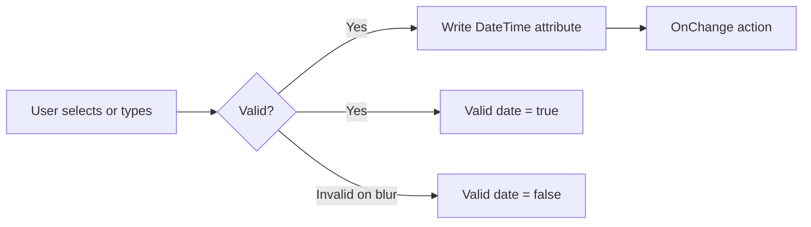

# InnoVites Date Time Picker — Widget Documentation

**InnoVites Mendix pluggable widget** · Version 1.0.0  
**Widget name in Studio Pro:** InnoVites Date Time Picker  
**Widget ID:** `innovites.muireactdatetimepicker.MUIReactDateTimePicker`

---

## Table of contents

1. [Overview](#1-overview)
2. [Installation](#2-installation)
3. [End-user experience](#3-end-user-experience)
4. [Studio Pro configuration](#4-studio-pro-configuration)
5. [Date and time formats](#5-date-and-time-formats)
6. [Locales](#6-locales)
7. [Validation and data binding](#7-validation-and-data-binding)
8. [Common use cases](#8-common-use-cases)
9. [Technical overview](#9-technical-overview)
10. [Customization](#10-customization)
11. [Limitations](#11-limitations)
12. [Troubleshooting](#12-troubleshooting)
13. [Support](#13-support)

---

## 1. Overview

The **InnoVites Date Time Picker** lets users select a **date**, a **time**, or **both** in Mendix web applications that use the **React client**. The popover UI is based on [MUI X Desktop Date/Time Pickers](https://mui.com/x/react-date-pickers/):

| Mode | What the user sees |
|------|-------------------|
| **Date & time** | Calendar (left) + analog clock with AM/PM (right) + footer (Today, Cancel, OK) |
| **Date only** | Calendar + footer |
| **Time only** | Analog clock + AM/PM + footer (Cancel, OK) |

The widget writes to a Mendix **`DateTime`** attribute. Formatting and parsing use **[date-fns](https://date-fns.org/)**; the visual components use **MUI X** and **Material UI**.

### When to use this widget

- Appointment booking, scheduling, deadlines
- Filters on date/time ranges
- Forms that need a clear calendar/clock instead of a plain text field
- Apps that require locale-specific date/time display (EU vs US, 12h vs 24h)

### Requirements

| Requirement | Detail |
|-------------|--------|
| Mendix | 9.x with **React client** (Web) |
| Attribute type | `DateTime` on the bound attribute |
| Browser | Modern desktop browsers (pointer/fine input; desktop picker layout) |
| Offline | Widget is marked offline-capable in the package |

---

## 2. Installation

### For Mendix developers (using the built `.mpk`)

1. Build the widget (or use a released `.mpk`):

   ```bash
   npm install
   npm run build
   ```

2. Copy **exactly one** file into your Mendix project:

   ```
   dist/1.0.0/innovites.MUIReactDateTimePicker.mpk
   → <YourApp>/widgets/
   ```

3. Open the project in **Studio Pro** and press **F4** (or sync app directory) so the widget appears in the toolbox.

4. Drag **InnoVites Date Time Picker** onto a page.

5. Set the **DateTime** property to a persistent or non-persistent `DateTime` attribute.

> **Duplicate packages:** If two `.mpk` files register the same widget ID, Studio Pro shows *“The following widget packages could not be read”*. Delete extra copies (e.g. `innovites.ReactDateTimePicker 2.mpk`).

### For widget developers (local development)

| Step | Command / action |
|------|------------------|
| Install | `npm install` |
| Point to Mendix app | Set `package.json` → `config.projectPath` to folder with `.mpr` |
| Hot reload | `npm run dev` (Mendix on `http://localhost:8080`) |
| Build only | `npm run build` |
| UI without Mendix | `npm run prototype` → http://localhost:5173 |

See [README.md](../README.md) for the full command reference.

---

## 3. End-user experience

### Opening the picker

- Click the **input field** or the **calendar/clock icon** on the right.
- A popover opens below the field (aligned to the start of the input).

### Date & time mode

1. **Calendar (left)**  
   - Choose a day.  
   - Use **‹ ›** in the header to change month.  
   - Click the month/year label to switch year/month views (MUI default).

2. **Clock (right)**  
   - Select **hour**, then **minute** (and **seconds** if enabled in format).  
   - Use **‹ ›** (top-right of clock area) to move between hour/minute views.  
   - **AM / PM** buttons appear when the locale/format uses 12-hour time.

3. **Footer**  
   - **Today** — sets the date to today; keeps the current time (datetime mode).  
   - **Cancel** — closes without applying pending changes.  
   - **OK** — applies the selection and closes.

### Date-only mode

Calendar and footer only (Today, Cancel, OK). No clock column.

### Time-only mode

Clock and footer (Cancel, OK). No calendar.

### Keyboard and typing

- Users can **type** directly in the field using the configured format.
- On **blur**, the widget validates typed text. Invalid input can set **Valid date** to `false` (if that attribute is configured).
- **Clear** — use the clear control on the field (when not read-only) to empty the value.

### Read-only

| Read-only style | Behavior |
|-----------------|----------|
| **Control** | Disabled input (greyed out) |
| **Text** | Plain text showing formatted date/time (no picker) |

---

## 4. Studio Pro configuration

Properties are grouped as in the widget definition.

### 4.1 General

| Property | Type | Required | Description |
|----------|------|----------|-------------|
| **DateTime** | Attribute (`DateTime`) | Yes | Value read and written by the widget |
| **Placeholder** | Text template | No | Hint when empty |
| **Valid date** | Attribute (`Boolean`) | No | Widget sets `true` when value is valid, `false` on invalid input. Initialize in Mendix (e.g. `true`) and grant **write** access |
| **Read-only style** | `Control` / `Text` | Yes | How read-only state is shown (from Editability) |

Standard Mendix properties also apply: **Label**, **Visibility**, **Editability**, **Tab index**.

### 4.2 Behavior

| Property | Type | Default | Description |
|----------|------|---------|-------------|
| **OnChange action** | Action | — | Runs when the value changes (after valid commit or clear) |
| **Close on select** | Boolean | `false` | If `true`, popover closes after each selection step |
| **Disable days in past** | Boolean | `false` | Disables all dates before today |
| **Minimal Date** | Attribute (`DateTime`) | — | Days before this date are disabled |
| **Maximal Date** | Attribute (`DateTime`) | — | Days after this date are disabled |
| **Initial View Date** | Expression (`DateTime`) | — | Calendar opens on this date when no value is set |

**Notes:**

- **Minimal / Maximal Date** use start/end of day internally for comparison.
- **Disable past** and **Minimal Date** can both apply; the stricter bound wins.

### 4.3 Date & time options

| Property | Type | Default | Description |
|----------|------|---------|-------------|
| **Picker** | Enum | `Datetimepicker` | `Datetimepicker`, `Datepicker`, or `Timepicker` |
| **Locale setting** | Text template | `en` (en_US) | Locale code for `date-fns` (see [§6](#6-locales)) |
| **Date format** | Text template | (locale default) | [date-fns format](https://date-fns.org/docs/format) for date part; empty = locale `P` |
| **Time format** | Text template | (locale default) | date-fns format for time; empty = 12h with AM/PM or 24h per locale |
| **Show Week Numbers** | Boolean | `false` | Shows ISO week number column |
| **Minimal hour** | Integer | `0` | Earliest selectable hour |
| **Maximal hour** | Integer | `23` | Latest selectable hour |
| **Hour step** | Integer | `1` | Step between selectable hours (e.g. `2` → 0, 2, 4, …) |
| **Minimal minute** | Integer | `0` | Earliest minute (per hour rules) |
| **Maximal minute** | Integer | `59` | Latest minute |
| **Minute step** | Integer | `1` | Minute step |
| **Minimal seconds** | Integer | `0` | Earliest second |
| **Maximal seconds** | Integer | `59` | Latest second |
| **Second step** | Integer | `1` | Second step; seconds view appears when format includes `s` / `ss` |

**Picker vs format:**

- In **Datepicker** mode, time format and time constraints are ignored.
- In **Timepicker** mode, date format and date-only options are ignored.

---

## 5. Date and time formats

Formats use **[date-fns format tokens](https://date-fns.org/docs/format)** (not Moment.js).

### Common patterns

| Goal | Date format | Time format |
|------|-------------|-------------|
| US | `MM/dd/yyyy` | `hh:mm a` |
| UK / EU day-first | `dd/MM/yyyy` | `HH:mm` |
| ISO-style | `yyyy-MM-dd` | `HH:mm` |
| With seconds | — | `HH:mm:ss` or `hh:mm:ss a` |
| Locale default | *(empty)* | *(empty)* |

### 12-hour vs 24-hour

- If **Time format** is empty, the widget uses **12-hour with AM/PM** when the locale typically does (e.g. `en`), otherwise **24-hour** (`HH:mm`).
- To force 12-hour: include `a` or `aa` in the time format (e.g. `hh:mm a`).
- To force 24-hour: use `HH` (e.g. `HH:mm`).

### Seconds

- The seconds ring on the clock is shown when the time format includes a **seconds token** (`s` / `ss`), e.g. `HH:mm:ss`.

---

## 6. Locales

Set **Locale setting** to a short code. Built-in mappings include:

| Code | Language |
|------|----------|
| `en`, `en-us` | English (US) |
| `nl` | Dutch |
| `de` | German |
| `fr` | French |
| `es` | Spanish |
| `it` | Italian |
| `pt` | Portuguese |
| `pl` | Polish |
| `sv` | Swedish |
| `da` | Danish |
| `nb` | Norwegian Bokmål |
| `fi` | Finnish |
| `cs` | Czech |
| `sk` | Slovak |
| `hu` | Hungarian |
| `ro` | Romanian |
| `tr` | Turkish |
| `ar` | Arabic |
| `ja` | Japanese |
| `ko` | Korean |
| `zh`, `zh-cn` | Chinese (Simplified) |
| `zh-tw` | Chinese (Traditional) |

Unknown codes fall back to **English (US)**.

---

## 7. Validation and data binding

### Value commit flow



- **Picker change:** Valid `Date` → attribute updated immediately via `onBlur` handler path from UI `onChange`.
- **Empty / clear:** Attribute set to **empty** (`undefined`); **Valid date** = `true`.
- **Invalid typed text on blur:** Attribute not updated; **Valid date** = `false`.

### Mendix validation message

If the bound **DateTime** attribute has a validation message (e.g. required), the widget shows it below the control in an alert-style message.

### Recommended pattern for “Valid date”

1. Add Boolean attribute `IsValidDate` (default `true` in entity or on create).
2. Bind it to **Valid date** on the widget.
3. In a save microflow, check `IsValidDate` before commit.
4. Optionally show a page message when `IsValidDate` is `false`.

---

## 8. Common use cases

### Appointment (date + time, no past dates)

| Setting | Value |
|---------|--------|
| Picker | Datetimepicker |
| Disable days in past | `true` |
| Locale | Your app locale |
| Time format | `hh:mm a` or `HH:mm` |
| OnChange | Refresh available slots |

### Birth date (date only)

| Setting | Value |
|---------|--------|
| Picker | Datepicker |
| Maximal Date | `[$currentDate]` or dedicated attribute |
| Date format | `dd/MM/yyyy` |

### Opening hours (time only)

| Setting | Value |
|---------|--------|
| Picker | Timepicker |
| Minimal hour | `8` |
| Maximal hour | `18` |
| Minute step | `15` |

### Read-only detail page

| Setting | Value |
|---------|--------|
| Editability | Read-only |
| Read-only style | Text |

---

## 9. Technical overview

### Architecture

```
Mendix Page
  └── ReactDateTimePicker (class container)
        ├── ReactDateTimePickerUI
        │     ├── MuiPickerProvider (Theme + LocalizationProvider + date-fns adapter)
        │     ├── DesktopDatePicker | DesktopDateTimePicker | DesktopTimePicker
        │     └── innovitesTimeClockViewRenderers (analog clock)
        └── Alert (Mendix validation message)
```

### Key dependencies

| Library | Role |
|---------|------|
| `@mui/x-date-pickers` | Desktop date/time pickers, layout, action bar |
| `@mui/material` | Input, theme, buttons |
| `date-fns` | Parse, format, locales |
| `@emotion/react` | Styling (MUI) |

### Offline

The widget package is marked **offline capable**. Values are stored on the Mendix object; the picker UI requires client-side React. Test offline behavior in your target Mendix version.

### Z-index

Popover styles use a high `z-index` so the calendar appears above Mendix modals and layouts.

---

## 10. Customization

### Styling

- Main stylesheet: `src/ui/ReactDateTimePicker.css`
- Theme overrides: `src/components/MuiPickerProvider.tsx`
- CSS variables are re-declared on `.innovites-dtp__popper` because the popover renders in a **portal** outside the widget root.

Default accent colors match **[InnoVites](https://www.innovites.com/)** brand gold (`#f7a823`) with warm cream surfaces (`#fff7e9`, `#ffe8c0`).

Example override (in your Mendix theme or custom CSS after deployment):

```css
.innovites-dtp__popper {
  --innovites-dtp-accent: #f7a823;
  --innovites-dtp-accent-dark: #d99218;
  --innovites-dtp-accent-soft: #fff7e9;
}
```

### Extending locales

Add entries to `localeMap` in `src/components/ReactDateTimePickerUI.tsx` and import the matching `date-fns/locale` module.

### Building a new version

1. Bump `version` in `package.json` and widget XML if needed.  
2. `npm run build`  
3. Deploy new `.mpk` and remove old duplicate packages.

---

## 11. Limitations

| Topic | Limitation |
|-------|------------|
| Mobile | Uses **desktop** MUI pickers; mobile layouts may differ from native mobile pickers |
| Time zones | Uses browser/local `DateTime`; no separate timezone picker |
| Range selection | Single date/time only (no built-in range) |
| Multiple selection | Not supported |
| Nanoflow | Test thoroughly on target Mendix version |
| Bundle size | Includes MUI X + MUI + date-fns (larger than a minimal custom input) |

---

## 12. Troubleshooting

| Symptom | Likely cause | Solution |
|---------|--------------|----------|
| Widget package could not be read | Duplicate `.mpk` | Keep one `innovites.MUIReactDateTimePicker.mpk`; remove old `reactdatetimepicker` packages |
| Widget not in toolbox | Not synced | F4 / Sync app directory; check `widgets/` folder |
| Picker does not open | Read-only / not available | Check Editability and attribute status |
| OK button invisible | Stale CSS or portal variables | Rebuild widget; hard refresh browser |
| AM/PM very faint | Same as above | Ensure latest `ReactDateTimePicker.css` is in build |
| Valid date always false | No write access | Grant write on Boolean attribute |
| Wrong format shown | Custom format typo | Verify [date-fns tokens](https://date-fns.org/docs/format) |
| Past dates still clickable | Disable past off | Enable **Disable days in past** or set **Minimal Date** |
| dev script fails | Wrong project path | Fix `config.projectPath` in `package.json` |

---

## 13. Support

| Resource | Location |
|----------|----------|
| Developer quick start | [README.md](../README.md) |
| Source repository | InnoVites `reactDateTimePicker` project |
| MUI X docs | https://mui.com/x/react-date-pickers/ |
| date-fns formats | https://date-fns.org/docs/format |

**Author:** Narendran Jaganathan · **InnoVites B.V.**  
**License:** MIT

---

*Document version: 1.0.0 — matches widget package 1.0.0*
